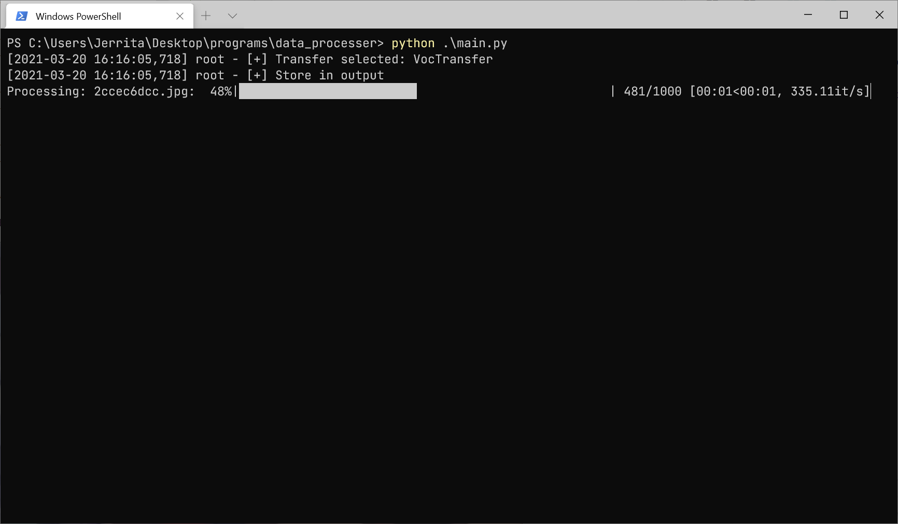

# Advanced data processor

目标是做一个简单好用的数据格式转换器，当前仅实现了 voc 格式的转换


## 警告

此仓库正在开发中，不同模块还处于手动调用的阶段，api 将随时更改


## 接口说明

此模块对标注的统一描述方式（details）目前为：List[dict] 形式

在 `data_loader` 处理每行 `csv` 时，你需要返回这种中间形式

```json
{
    'name': '<图片名>.jpg',
    'details': [
        {
            'name': '<分类类别>',
            'bndbox': {
                'xmin': xmin,
                'ymin': ymin,
                'xmax': xmax,
                'ymax': ymax
            }
        },
        ...  // 如果有多个框，在此处添加
    ]
}
```


## 使用方式
安装
```bash
pip install -r requirements.txt
```

使用 （详见代码内文档）

你需要新建一个类，继承至 `DataProcessor`，并重写 `data_loader` 方法

```python
import pandas as pd

from bbox import BBox2D
from processor import DataProcessor


class MyProcessor(DataProcessor):
    def data_loader(self, db: pd.DataFrame) -> dict:
        bbox = BBox2D(eval(db['bbox']))
        return {
            'name': db['image_id'] + '.jpg',
            'details': [{
                'name': db['source'],
                'bndbox': {
                    'xmin': bbox.x1,
                    'ymin': bbox.y1,
                    'xmax': bbox.x2,
                    'ymax': bbox.y2,
                }
            }]
        }

```

然后就可以通过不同的 `Transfer` 进行数据转换了

```python
from transfer import VocTransfer
from myprocessor import MyProcessor

if __name__ == '__main__':
    train_csv = 'lib/train.csv'

    dp = MyProcessor(VocTransfer, output='output')
    dp.set_data_root_path('lib/images')
    dp.load_from_csv(train_csv, stop_at=1000)
```


## 使用截图

